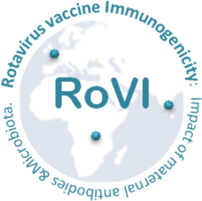

## RoVI study analysis page

This github page contains the code and input data associated with the [RoVI study](https://www.liverpool.ac.uk/infection-and-global-health/rovi/) – a prospective cohort study exploring the impact of maternal antibodies and microbiota development on the immunogenicity of oral rotavirus vaccine (ORV) in African, Indian, and European infants. For a description of the study design, please refer to the published protocol paper by [Sindhu et al (2017) ](https://pubmed.ncbi.nlm.nih.gov/28719399/).

 

## Primary outcome paper

The primary outcome paper of the RoVI study is now available on [*medRxiv*](https://www.medrxiv.org/content/10.1101/2020.11.02.20224576v2) . All figures and statsical analyses from this paper can be recreated using the code and data in this github repository.

## Bioinformatics code

The raw sequence data generated during this study have been deposited in the European Nucleotide Archive (accession number PRJEB38948). The **bioinformatics** folder contains the scripts *RoVI_qiime2_pipeline.sh* (for processing 16S rRNA reads using qiime2) and *RoVI_taxonomy_assignment.R* (for adding taxonomic assignments to processed reads using dada2) used to analyse these sequence data.

## Statistical analysis R code

The statistical analyses are arranged as follows:
- The **input** folder contains the outputs of the bioinformatics analyses, including the feature table (*RoVI_input_table_clean.txt*), taxonomic assignments (*silva_plus.csv* and *silva_multiple.csv*) and read counts (*qiime2_stats_14102020.csv*). It also contains sample metadata (*RoVI_metadata_by_sample.csv*), nanodrop readings for each sample (*nanodrop.csv*) and a list of duplicated samples to be removed from the final analysis (*duplicates_to_exclude.csv*). Finally, it contains files comprising package lists and functions for the statistical analyses (*packages_and_functions.R* and *RF_functions.R*).
- **Rmd** markdown files containing the statistical analysis code for each analysis module.
- **html** output files containing statistical analysis results.
- **output** folders containing additional statistical analysis outputs.
Large files are zipped to reduce file size.

## Analysis modules

Current analyses include the following 5  modules:
- **RoVI_module1_16S_stats:** run statistics, filtering of the 16S rRNA feature table, analysis of run-to-run variation, 10% validation of 16S rRNA sequencing, and unsupervised clustering of infant and maternal stool samples.
- **RoVI_module2_shedding_antibodies_EED:** rotavirus vaccine shedding and immunogenicity by country, maternal antibodies ve country and ORV outcome, inflammatory biomarkers vs country and ORV outcome, neonatal rotavirus exposure vs ORV outcome.
- **RoVI_module3_16S_vs_country:** analysis of geographic discrepancies in gut microbiota composition, including alpha diversity, beta diversity,  composition of major genera, statistical learning results (Random Forests), and zero-inflated negative binomial model outputs.
- **RoVI_module4_16S_vs_ORV:** analysis of gut microbiota composition in relation to ORV outcome, including alpha diversity, beta diversity,  composition of major genera, statistical learning results (Random Forests), and zero-inflated negative binomial model outputs.
- **RoVI_module5_multivariate_models:** integrated analysis of infant and maternal cofactors associated with ORV outcome, including statistical learning results (Random Forests), and univariate and multivariate regression analyses.
- **RoVI_module6_16S_vs_demography:** an exploratory analysis of variables associated with microbiota composition (alpha and beta diversity) at the time of the first dose of ORV in each cohort.
Additional information is contained in the annotations of each **Rmd** file.

## Contact
edward.parker@lshtm.ac.uk
